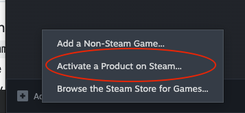
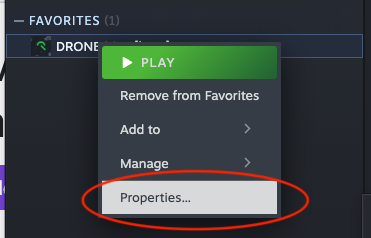
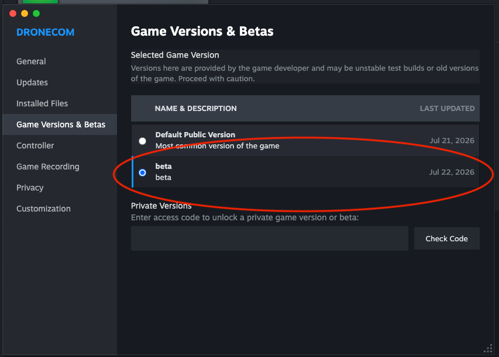
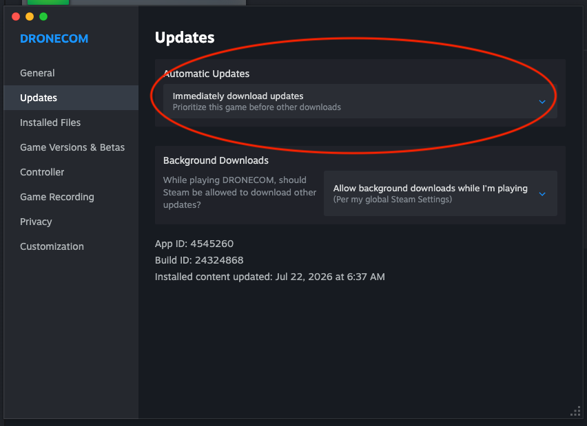
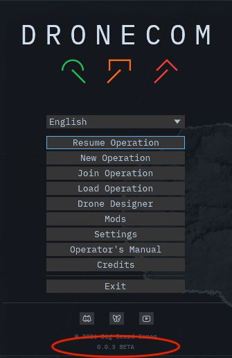

# DRONECOM playtest — setup guide

To join the DRONECOM playtest, please DM me for a steam key. Once you have a key here is how to setup DRONECOM on steam:

## 1. Activate your key

Bottom-left of your library → **+ Add a game** → **Activate a Product on Steam...** → paste the key.

DRONECOM should now shows up in your library and you will be able to install it.

## 2. Switch to the beta branch

**This is the important step.** Playtest builds go to the `beta` branch — the default branch is usually behind.

Right-click **DRONECOM** in your library → **Properties...** → **Game Versions & Betas** → select **beta**.

Steam shuuld starts downloading the beta build as soon as you select it

## 3. Turn on immediate updates

Still in **Properties...** → **Updates** → set **Automatic Updates** to **Immediately download updates**.

Builds ship often during the playtest, so this will download the latest version often

## Done — and how to tell which build you're on

The version is shown at the bottom the game's main menu, and pause menu (escape key).

Steam also lists a **Build ID** at the bottom of **Properties... → Updates**.

## Reporting bugs and feedback

Please share feedback about the game -- all positive and negative feedback welcome.

You can share this on github at https://github.com/peterellisjones/dronecom-community/issues/new/choose , or in the #dronecom-playtesting discord channel

Thanks for playing!
